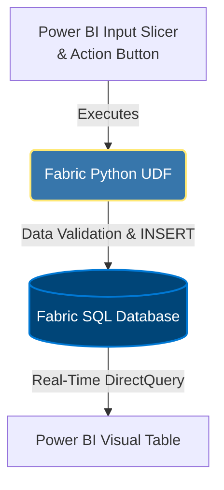

# 🔄 Power BI & Fabric: Native Writeback & Closed-Loop Analytics

## 📌 Executive Summary
Standard BI dashboards are historically passive—they only report on what has happened. This repository demonstrates an enterprise architecture pattern that transcends traditional reporting by acting as an active **Data App**. 
Demo:

https://github.com/user-attachments/assets/7f302426-1fc5-4746-89fa-6df6e605b434

By leveraging **Microsoft Fabric Native Writeback**, users can take immediate operational action on insights without leaving the Power BI environment, creating a true "Closed-Loop" analytical pipeline.

## ⚙️ The Architecture Flow

The data flow seamlessly connects the Power BI front-end with the Fabric compute and storage layer, utilizing DirectQuery to instantly refresh the visual state.

## 🛠️ Technical Implementation

### 1. Fabric SQL Database (The Storage)
A dedicated, serverless Fabric SQL Database (`FPA_Writeback_DB`) is deployed to capture user-generated inputs. The schema is designed with strict data governance and automated audit trails (`CreatedAt`, `CreatedBy`).
* 📁 **Source Code:** [`/src/setup_database.sql`](./src/setup_database.sql)

### 2. Python User-Defined Functions (The Compute)
Custom Fabric UDFs are utilized to bridge Power BI and SQL. The Python script securely processes the inputs passed from DAX (via explicit string casting), validates character limits, and executes the parameterized SQL `INSERT` commands.
* 📁 **Source Code:** [`/src/writeback_udf.py`](./src/writeback_udf.py)

### 3. Power BI Integration (The Interface)
* **Explicit DAX Type Casting:** To pass dynamic filter context into the Python function, `SELECTEDVALUE()` is wrapped in `CONVERT(..., STRING)` to strictly match the UDF parameter types.
* **DirectQuery Injection:** The writeback table is integrated back into the semantic model via DirectQuery. This creates a real-time feedback loop where the user's action plan instantly renders in the report's visual table, bypassing the need for a scheduled dataset refresh.

## 🎯 Business Use Case (Example)
**Strategic Action Planning:** When an FP&A controller identifies an "Empty Calorie" client (high volume, negative margin) on the scatter plot, they can instantly select the client, log a strategic mitigation plan (e.g., *"Renegotiate contract by +5% in Q3"*), and save it. The data is instantly broadcasted to the centralized SQL instance for organizational alignment.
